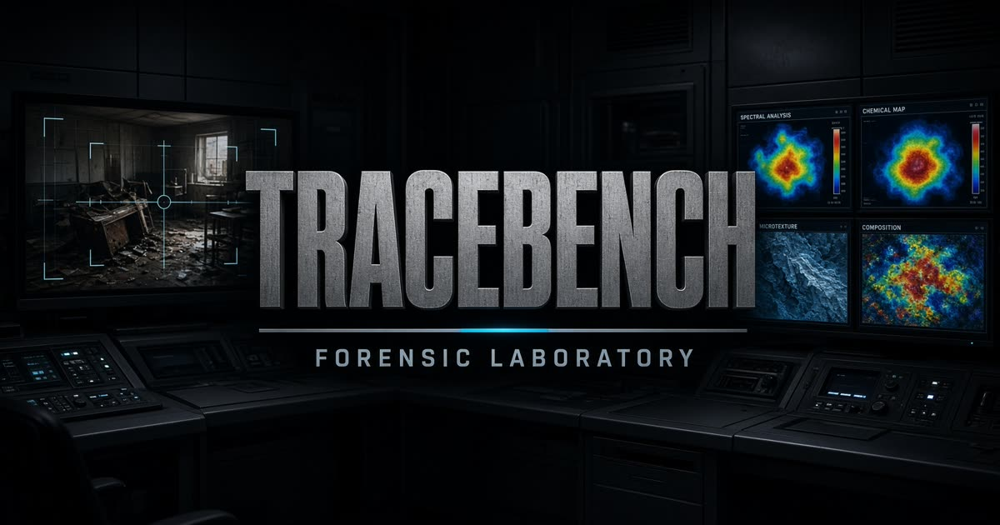

# <p align="center"> Tracebench</p>

<p align="center">
  <strong>Local Digital Image Forensics Laboratory. Measurements, not verdicts.</strong>
</p>

<p align="center">
  
</p>

<p align="center">
  <a href="https://forensics6.pages.dev/"></a>
  <a href="https://github.com/Quincunx33/image-forensics"></a>
  <a href="#license"></a>
  <a href="#rust--webassembly-core"></a>
  <a href="#zero-upload-privacy"></a>
  <a href="https://react.dev"></a>
  <a href="https://www.typescriptlang.org"></a>
</p>

<p align="center">
  <a href="https://forensics6.pages.dev/"><strong>🌐 Live Demo: forensics6.pages.dev</strong></a> •
  <a href="https://github.com/Quincunx33/image-forensics"><strong>📂 GitHub Repository</strong></a> •
  <a href="#-key-features"><strong>✨ Features</strong></a> •
  <a href="#-quick-start"><strong>🚀 Quick Start</strong></a> •
  <a href="#-javascript--typescript-quickstart-client-side-wasm"><strong>💻 SDK Usage</strong></a>
</p>

---

## 🔬 Overview

**Tracebench** is a high-precision, privacy-first digital image forensics suite designed for digital forensics investigators, journalists, fact-checkers, and security researchers. 

Unlike conventional cloud-based forensics tools that upload sensitive investigative evidence to remote servers, **Tracebench executes 100% locally inside your browser** using a high-performance **Rust / WebAssembly** pipeline backed by Web Workers and pure client-side cryptographic hashing.

> *"We provide rigorous physical, statistical, and compression measurements — never opaque AI verdicts or black-box percentages."*

---

## ✨ Key Features

| Capability | Description |
| :--- | :--- |
| **🛡️ Zero-Upload Privacy** | Your evidence never leaves your device. No telemetry, no cloud processing, no third-party APIs. |
| **⚡ Rust + WebAssembly Engine** | Core mathematical routines (DCT, 2D FFT, 2D Laplacian, Sobel/Scharr, block matching) compiled to native WASM32 bytecode. |
| **🧵 Background Web Workers** | Heavy computations run in background threads to ensure buttery 60 FPS UI responsiveness on high-resolution images. |
| **🔍 15 Forensic Analysis Modules** | ELA, local noise variance, DCT coefficient analysis, frequency domain FFT, clone/copy-move detection, and more. |
| **🎛️ Dual-Pane Comparative Viewers** | Side-by-side, split-curtain wipe, pixel difference, alpha blend, and synchronized ultra-zoom magnifier loupe. |
| **🎨 6 Scientific Colormaps** | Jet, Viridis, Inferno, Turbo, Bone, and Copper colormaps with dynamic percentile contrast stretching (p05–p99). |
| **📐 Region of Interest (ROI)** | Draw custom bounding boxes to extract localized statistical distributions, entropy, and energy metrics. |
| **📜 Chain of Custody & Audit Log** | Automatic SHA-256 integrity verification, timestamping, parameter tracking, and immutable session event log. |
| **📑 Court-Ready Reports** | One-click export of standalone, cryptographically referenced HTML/PDF forensic reports with embedded visual heatmaps. |

---

## 🧬 Forensic Analysis Modules

```
                        ┌─────────────────────────────────────────────────────┐
                        │              Digital Image Evidence                 │
                        └──────────────────────────┬──────────────────────────┘
                                                   │
         ┌───────────────────┬─────────────────────┼─────────────────────┬───────────────────┐
         ▼                   ▼                     ▼                     ▼                   ▼
   [ Compression ]       [ Spatial ]          [ Frequency ]         [ Geometric ]        [ Sensor ]
   ├── ELA Analysis      ├── Noise Variance   ├── DCT 8x8 Grids     ├── Resampling D2    ├── CFA Artifacts
   ├── Quantization      ├── Sobel Edges      └── 2D FFT Spectrum   └── Clone Detection  └── PRNU Residue
   └── Double JPEG       └── Lapl. Sharpness
```

### 1. Compression Domain
- **Error Level Analysis (ELA)**: Re-compresses the image at calibrated quality levels (e.g. 75%, 90%, 95%) and scales the difference matrix to expose uneven compression ratios indicative of spliced elements.
- **DCT 8x8 Coefficient Distribution**: Visualizes high-frequency quantization degradation and detects periodic zero-runs characteristic of double compression.
- **Double JPEG Grid Inconsistency**: Scans for 8x8 macroblock boundary shifts caused by cropping or re-saving.

### 2. Spatial & Noise Domain
- **Integral Image Noise Variance**: Estimates localized sensor noise variance to highlight regions with incompatible signal-to-noise ratios (SNR).
- **Sobel / Scharr Gradient Magnitude**: Surfaces abrupt structural discontinuities along object boundaries.
- **Laplacian Variance / Sharpness**: Maps localized blur and focus gradients across the focal plane.
- **Opponent Color Discontinuity**: Evaluates chromatic aberration consistency across contrasting edges.

### 3. Frequency Domain
- **2D Fast Fourier Transform (FFT)**: Computes 2D power spectral density to detect periodic interpolation lattices, screen-door moiré patterns, or synthetic generation artifacts.
- **Band Energy Partitioning**: Breaks down radial spectral distribution into low, medium, and high frequency bands.

### 4. Geometric & Sensor Forensics
- **Resampling & Periodicity**: Detects second-order derivative periodic spikes caused by affine transformations, scaling, and rotation.
- **Clone / Copy-Move Detection**: Employs spatial block matching and feature clustering to isolate duplicated or cloned regions.
- **Color Filter Array (CFA)**: Analyzes Bayer pattern demosaicing residues to detect non-sensor origin or tampered interpolation.
- **Photo-Response Non-Uniformity (PRNU)**: Sensor pattern noise residual extraction for camera fingerprinting.

---

## 🖥️ Workstation Interface

<p align="center">
  
</p>

- **Dual-Pane Viewport**: Toggle between Single view, Split slider, Side-by-Side comparison, Difference subtraction, or Alpha blend.
- **Precision Loupe**: High-magnification pixel inspector showing RGBA values, normalized luminance, and local gradient vectors.
- **Dynamic Histogram**: Real-time statistical histogram with adjustable threshold sliders and percentile clip indicators.
- **EXIF & Structure Tree**: Deep inspection of EXIF, TIFF tags, JFIF markers, and embedded thumbnail cross-checks.

---

## 📦 Architecture & Stack

Tracebench is architected as a modern, decoupled web application:

- **Frontend Core**: React 19 + TanStack Router + Tailwind CSS
- **Forensic Engine**: 
  - `Rust (wasm32-unknown-unknown)`: High-throughput pixel loops, DCT transform, FFT, and spatial convolution.
  - `TypeScript Web Worker`: Asynchronous pipeline management, fallback CPU engine, and memory safety guards.
- **Packaging & Deployment**:
  - `Vite` for development and bundling.
  - `Nitro` universal server engine configured for multi-cloud targets: **Cloudflare Pages** (`dist/_worker.js`) and **Vercel** (`.vercel/output`).
  - `PGLite` in-browser SQLite/PostgreSQL engine for local state persistence.

```
📁 Tracebench Workspace
├── 📁 src/
│   ├── 📁 components/lab/    # Workstation, Viewers, EXIF Panel, Toolbars
│   ├── 📁 lib/forensic/      # Rust WASM glue, Worker client, Colormaps, Reports
│   ├── 📁 routes/            # TanStack Router routes (/, /pack)
│   └── 📁 workers/           # Background forensic computational threads
├── 📁 public/
│   ├── 📁 pack/              # Complete Rust source code & Cargo.toml bundle
│   ├── 📄 forensic-engine.wasm# Pre-compiled high-performance WebAssembly module
│   └── 📄 og.jpg             # Project banner and card assets
├── 📁 scripts/               # Build wrappers, cloudflare & vercel dist synchronizers
└── 📄 vite.config.ts         # Dual Cloudflare/Vercel Nitro deployment configuration
```

---

## 🚀 Quick Start

### Prerequisites
- [Node.js](https://nodejs.org) >= 20.x
- `npm` or `pnpm`

### Installation

```bash
# Clone the repository
git clone https://github.com/Quincunx33/image-forensics.git
cd image-forensics

# Install dependencies
npm install

# Start local development server
npm run dev
```

Open your browser and navigate to `http://localhost:8080` (or `http://localhost:3000`).

---

## 🛠️ Build & Deployment

### Standard Production Build
```bash
npm run build
```

### 🌐 Cloudflare Pages Deployment

The production release is continuously deployed to Cloudflare Pages:
👉 **[https://forensics6.pages.dev/](https://forensics6.pages.dev/)**

Tracebench is configured with full client-side WASM routing and zero-configuration asset serving:
```bash
CF_PAGES=1 npm run build
# Deploy the generated dist/ directory to Cloudflare Pages
```

### Type Checking & Code Quality
```bash
npm run typecheck
npm run lint
```

---

## 🦀 Standalone Rust Engine (`/pack`)

Tracebench includes a complete, standalone Rust crate located in `public/pack/` that can be compiled to native binaries or embedded in external pipelines:

```bash
cd public/pack
cargo test --release
cargo bench
```

Exports high-throughput C-ABI functions:
- `tb_ela(image_ptr, width, height, quality, scale)`
- `tb_noise_var(image_ptr, width, height, window_size)`
- `tb_dct_stats(image_ptr, width, height)`
- `tb_sobel(image_ptr, width, height)`

---

## 💻 JavaScript / TypeScript Quickstart (Client-Side WASM)

You can use the standalone `forensic-engine.js` wrapper and `forensic-engine.wasm` in any web application or script without framework lock-in.

### 1. Basic Usage

```javascript
import { WasmEngine } from "./forensic-engine.js";

// 1. Initialize WASM module
const eng = await WasmEngine.load("./forensic-engine.wasm");

// 2. Set pixel buffer (RGBA Uint8Array) and dimensions
eng.setImage(rgba, width, height);

// (Optional) Pass original file bytes for JPEG marker and quantization analysis
eng.setFile(fileBytes);

// 3. Run Forensic Analysis:
// ELA: quality (1-100), gain (e.g. 12), percentile stretch (e.g. 98)
const { gray, stats, extra } = eng.ela(90, 12, 98);

// Local noise variance: method ('integral' | 'median'), windowSize (3-31)
const noiseRes = eng.noise("integral", 7, 10, 99);

// Gradient edge analysis: method ('sobel' | 'scharr')
const edgeRes = eng.edge("sobel", 8, 98);

// Clone / Copy-Move detection: block (16), stride (4), threshold (18), minRadius (32)
const cloneRes = eng.clone(16, 4, 18, 32, 10, 99);

console.log("Calculated statistical metrics:", stats);
// { mean, median, std, min, max, p05, p95, p99, energy, entropy }
```

### 2. Complete Browser Example (from `<input type="file">`)

```html
<input type="file" id="fileInput" accept="image/*" />
<canvas id="canvas"></canvas>

<script type="module">
  import { WasmEngine } from "./forensic-engine.js";

  const input = document.getElementById("fileInput");
  const canvas = document.getElementById("canvas");
  const ctx = canvas.getContext("2d");

  input.addEventListener("change", async (e) => {
    const file = e.target.files[0];
    if (!file) return;

    // Load file bytes & image
    const fileBytes = new Uint8Array(await file.arrayBuffer());
    const img = new Image();
    img.src = URL.createObjectURL(file);
    await img.decode();

    canvas.width = img.width;
    canvas.height = img.height;
    ctx.drawImage(img, 0, 0);

    const imgData = ctx.getImageData(0, 0, img.width, img.height);
    const rgba = new Uint8Array(imgData.data.buffer);

    // Initialize WASM & compute ELA
    const eng = await WasmEngine.load("./forensic-engine.wasm");
    eng.setImage(rgba, img.width, img.height);
    eng.setFile(fileBytes);

    const { gray, stats } = eng.ela(90, 12, 98);

    // Render resulting grayscale heatmap onto the canvas
    const outImgData = ctx.createImageData(img.width, img.height);
    for (let i = 0; i < gray.length; i++) {
      const val = gray[i];
      outImgData.data[i * 4] = val;     // R
      outImgData.data[i * 4 + 1] = val; // G
      outImgData.data[i * 4 + 2] = val; // B
      outImgData.data[i * 4 + 3] = 255; // Alpha
    }
    ctx.putImageData(outImgData, 0, 0);
  });
</script>
```

---

## ⚖️ Ethical Forensics Manifesto

Forensic analysis requires scientific humility:
1. **Never claim absolute certainty**: Compression artifacts, multiple resaves, and online re-encodings (e.g. social media messaging platforms) degrade high-frequency signals.
2. **Context matters**: An artifact in an isolated region is an *indicator*, not definitive proof of malicious tampering.
3. **Cross-validate**: Always combine spatial, frequency, and container metadata before forming an expert opinion.

---

## 📄 License

This project is open-source software licensed under the **[MIT License](LICENSE)**.

---

<p align="center">
  <sub>Engineered with precision for truth and transparency. Tracebench 2026.</sub>
</p>
